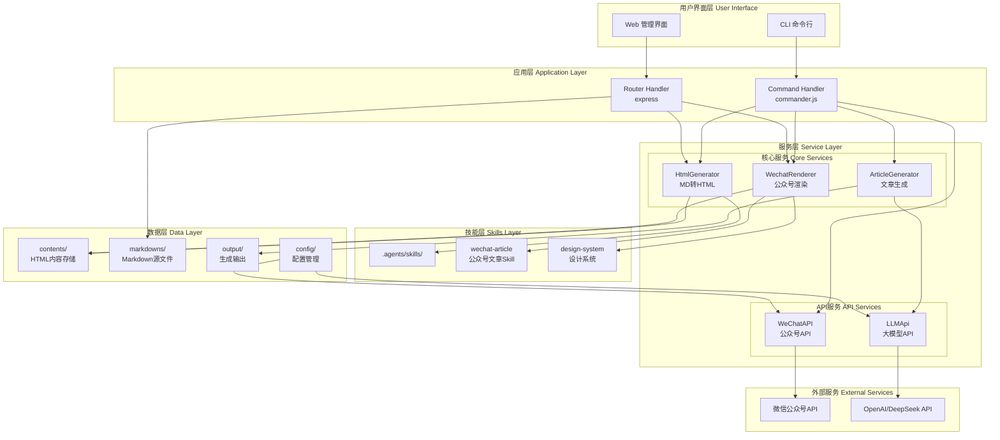
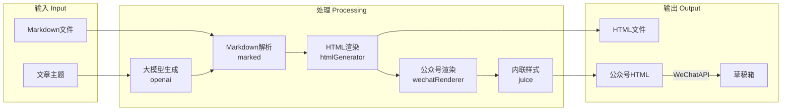
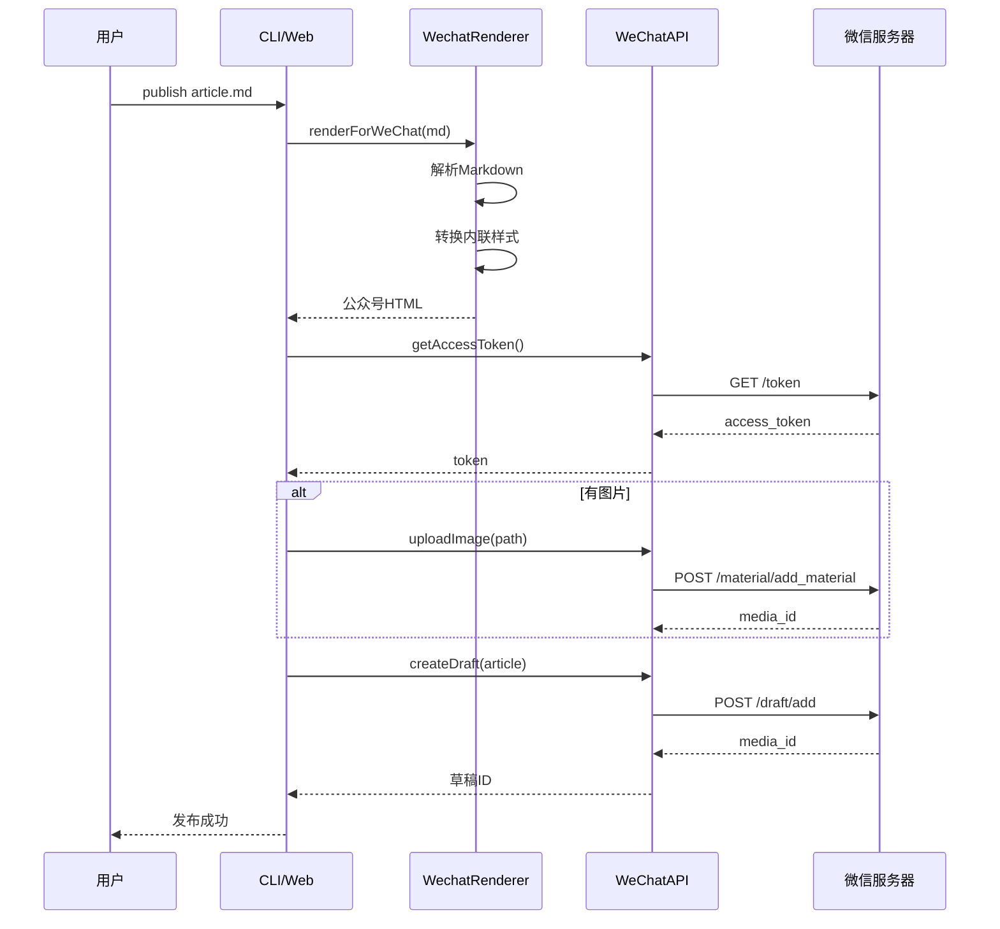
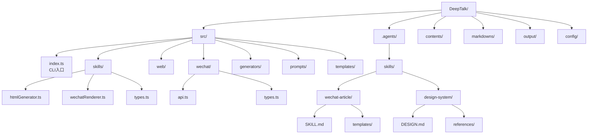
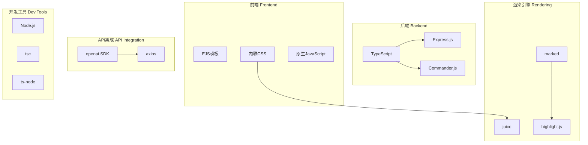
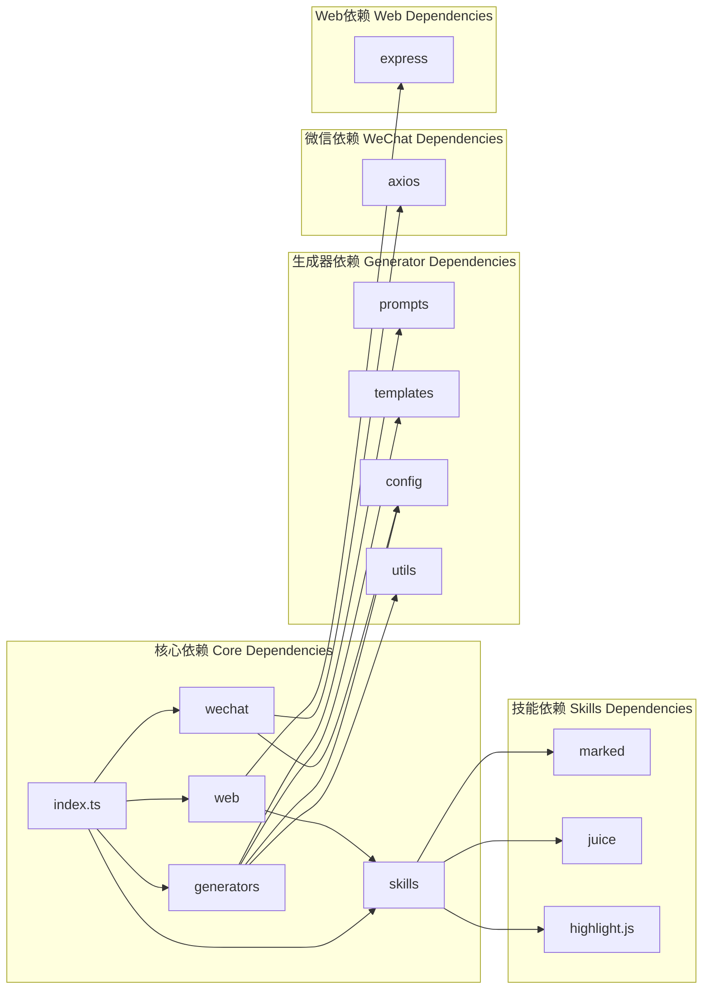

# DeepTalk 架构设计

## 系统架构图



## 核心模块数据流图



## 公众号发布流程图



## 目录结构图



## 技术栈分层图



## 模块依赖关系图



## 架构设计原则

### 1. 分层架构 (Layered Architecture)

| 层级 | 职责 | 模块 |
|------|------|------|
| 表现层 | 用户交互 | CLI, Web UI |
| 应用层 | 请求处理 | Command Handler, Router |
| 服务层 | 业务逻辑 | Generator, Renderer, API |
| 数据层 | 数据存储 | contents/, output/, config/ |

### 2. 关注点分离 (Separation of Concerns)

- **渲染逻辑**: `skills/htmlGenerator.ts`, `skills/wechatRenderer.ts`
- **API 集成**: `wechat/api.ts`, `generators/index.ts`
- **配置管理**: `config/index.ts`
- **CLI 入口**: `index.ts`

### 3. 开闭原则 (Open/Closed Principle)

- 新增主题：扩展 `themes` 对象，无需修改核心逻辑
- 新增 API：实现新接口，注入到 CLI
- 新增 Skill：在 `.agents/skills/` 添加目录

### 4. 依赖倒置 (Dependency Inversion)

```typescript
// 高层模块不依赖低层模块，两者都依赖抽象
interface Renderer {
  render(content: string, options: RenderOptions): string;
}

class HtmlGenerator implements Renderer { }
class WechatRenderer implements Renderer { }

// 高层模块
class ArticleService {
  constructor(private renderer: Renderer) {}
}
```

## 扩展点设计

### 1. 渲染器扩展

```typescript
// src/skills/types.ts
export interface Renderer {
  name: string;
  render(content: string, options: RenderOptions): string;
}

// 注册新渲染器
Registry.registerRenderer('wechat', new WechatRenderer());
```

### 2. 主题扩展

```typescript
// 新增主题只需添加配置
const themes = {
  tech: { /* ... */ },
  business: { /* ... */ },
  custom: { /* 用户自定义 */ }
};
```

### 3. API 扩展

```typescript
// 支持多个平台
interface PublishAPI {
  publish(article: Article): Promise<string>;
}

class WeChatAPI implements PublishAPI { }
class MediumAPI implements PublishAPI { } // 未来扩展
```
